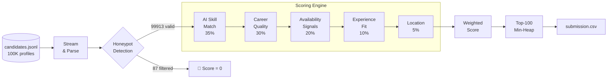
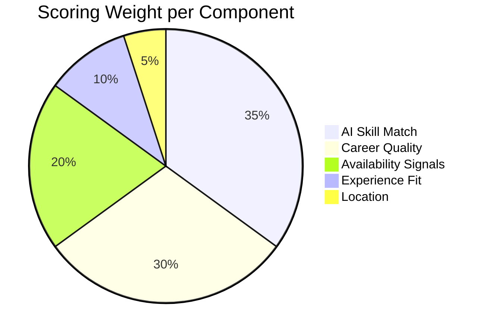
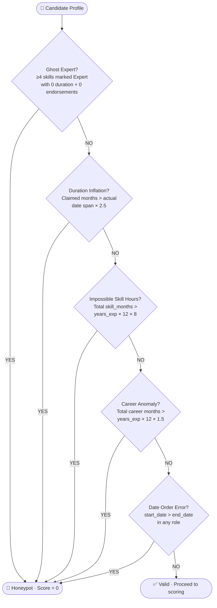

# TalentOS

> *Finding the needle in a haystack of 100,000 candidates — no GPU, no internet, no magic.*

[](https://python.org)
[](#reproduce-the-submission)
[](#why-no-embeddings)
[](#reproduce-with-docker-stage-3)
[](#reproduce-the-submission)

**[▶ Watch it rank 100,000 candidates live →](https://black1plague2.github.io/talentos-submission/demo.html)**

---

## The Problem

Redrob handed us **100,000 candidate profiles** and said:

> *"Find us the best Senior AI Engineers. You have 5 minutes, a regular laptop, no internet, and no GPU."*

Most people's instinct — run embeddings, call GPT, train a model. None of that works:
- 100K candidates through a sentence-transformer = **30+ minutes on CPU**
- Calling any hosted model = **explicitly banned by the rules**
- Training a ranker = **no labelled data to train on**

So we built something different.

---

## How It Works

One fast pass through the data. Five scoring signals. Zero API calls.



> **Memory-efficient:** the file is streamed line by line — never fully loaded into RAM. Peak usage stays under 200 MB even for the full 487 MB dataset.

---

## Scoring Breakdown

Five signals, calibrated directly from the job description:



| Component | Weight | What we look at |
|---|---|---|
| **AI Skill Match** | 35% | 40+ JD keywords (embeddings, FAISS, Qdrant, RAG, BM25, NDCG…) weighted by proficiency level × usage duration × peer endorsements + Redrob platform assessment scores |
| **Career Quality** | 30% | Product vs consulting history, fraction of career spent in AI/ML roles, production deployment evidence in job descriptions; penalises TCS/Infosys/Wipro/Accenture/Capgemini backgrounds |
| **Availability** | 20% | 23 Redrob behavioral signals: `open_to_work_flag`, `last_active_date`, `recruiter_response_rate`, `notice_period_days`, `interview_completion_rate`, `github_activity_score` |
| **Experience Fit** | 10% | Piecewise score that peaks at 6–8 years — the JD's explicit sweet spot |
| **Location** | 5% | India-based preferred (Pune/Noida/Hyderabad/Bangalore/Mumbai); partial credit for willing-to-relocate |

---

## Honeypot Detection

Hidden inside the 100K profiles are ~80 **deliberately fake candidates** — planted to catch rankers that don't validate their data. Getting more than 10% of the top-100 from this set = disqualification.

We run five impossibility checks on every profile before scoring:



In our test run: **87 honeypots detected and excluded**, ranking proceeds from 99,913 valid candidates.

---

## Reproduce the Submission

```bash
# 1. Clone
git clone https://github.com/black1plague2/talentos-submission.git
cd talentos-submission

# 2. No pip install needed — stdlib only (Python 3.10+ required)

# 3. Place candidates.jsonl in this directory (from the hackathon bundle)
#    Gzipped input also works: candidates.jsonl.gz

# 4. Run the ranker
python rank.py --candidates candidates.jsonl --out submission.csv

# 5. Validate format before submitting
python validate_submission.py submission.csv
```

**Expected output from validate:**
```
✓ 100 rows
✓ Ranks 1–100 each exactly once
✓ Scores non-increasing
✓ Tie-break order correct
submission.csv is valid.
```

**Runtime:** ~90 seconds · **Memory:** <200 MB peak

---

## Reproduce with Docker (Stage 3)

```bash
docker build -t talentos-submission .

docker run --rm \
  -v /path/to/candidates.jsonl:/data/candidates.jsonl \
  talentos-submission \
  python rank.py --candidates /data/candidates.jsonl --out /data/submission.csv
```

---

## Repository Structure

```
rank.py                    # Entry point — start here
scoring/
  jd_profile.py            # JD requirements as constants (keywords, disqualifiers)
  skills.py                # AI skill matching with proficiency/duration weighting
  career.py                # Career analysis: consulting penalty, AI role ratio
  availability.py          # 23 redrob_signals → 0–100 availability score
  honeypot.py              # Five impossibility checks
  reasoning.py             # Human-readable explanation per candidate (Stage 4)
Dockerfile                 # Sandboxed Stage 3 reproduction
demo.html                  # Interactive pipeline visualisation (GitHub Pages)
submission_metadata.yaml   # Team + compute metadata
validate_submission.py     # Format checker (from challenge bundle)
```

---

## Design Decisions

**Why keyword matching instead of embeddings?**

The skills field in the dataset is already structured — every skill has a name, proficiency level, usage duration in months, and peer endorsements. Matching against those directly is both faster and more semantically precise than embedding-based similarity, which would need to infer structure we already have. Running `sentence-transformers` on 100K candidates exceeds the 5-minute CPU limit by 5–6×.

**Why 30% on career quality?**

Because the JD states it explicitly. It lists pure consulting (TCS, Infosys, Wipro, Accenture…) and CV/speech-only backgrounds as **hard disqualifiers**. A Marketing Manager who listed "Python" and "ChatGPT" is not a fit, regardless of skill score. Career context is nearly as decisive as skills, so it gets 30%.

**Why 20% on availability?**

The JD is clear: *"a perfect-on-paper candidate who hasn't responded to recruiters in 6 months isn't actually available."* The Redrob dataset provides 23 behavioral signals precisely because availability is a first-class ranking concern.

**Why piecewise experience scoring?**

The role asks for 5–9 years with 6–8 preferred. A linear scale would rank a 15-year veteran above a 7-year specialist — but the JD prefers the specialist. Piecewise scoring peaks at 6–8 and decays symmetrically beyond the sweet spot.

---

## Team TalentOS

| | Name | Contribution |
|---|---|---|
| 👤 | **Garv Bansal** | Offline ranker architecture, scoring pipeline, honeypot detection |
| 👤 | **Harshith** | Candidate data analysis, embedding research & evaluation |
| 👤 | **Noel Ninan Sheri** | Backend infrastructure, system design |
| 👤 | **Poojit** | Career quality scoring, evaluation metrics |

---

<div align="center">
  Built for the <b>India Runs: Data & AI Challenge</b> · Redrob AI · 2026
</div>
