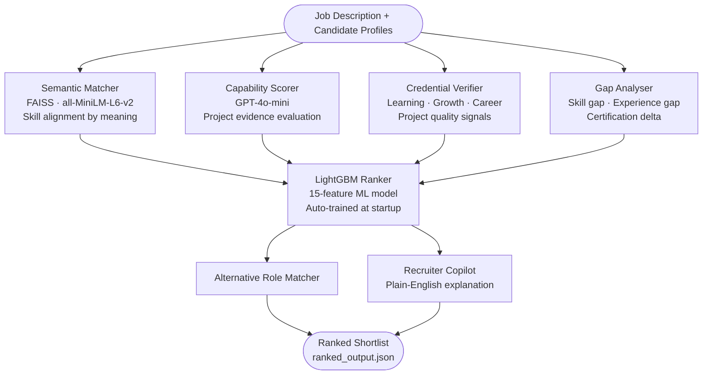

<div align="center">

# 🧠 TalentOS
### AI-Powered Candidate Ranking Engine

*Goes beyond keyword matching — understands context, validates credentials, and ranks intelligently.*

[](https://python.org)
[](https://fastapi.tiangolo.com)
[](https://lightgbm.readthedocs.io)
[](https://docker.com)

</div>

---

## 🎯 What It Does

TalentOS takes a job description and a pool of candidate profiles, then produces a **ranked shortlist** with scores and explanations — acting as an AI recruiter that can:

- **Understand job descriptions semantically** — not just by keyword
- **See beyond buzzwords** — matches "React experience" even when a candidate lists "JavaScript framework"
- **Validate credentials** — scores candidates on projects, certifications, GitHub activity, and career growth
- **Explain every decision** — each ranked candidate comes with a plain-English hiring recommendation

---

## 🗺️ How It Works



---

## 🔬 Methodology

### Step 1 — Semantic Skill Matching
Uses `all-MiniLM-L6-v2` embeddings + FAISS vector search to find skill overlap by **meaning**, not exact text. A candidate listing "Node.js" can still match a requirement for "server-side JavaScript."

### Step 2 — Capability Evaluation
GPT-4o-mini reads the candidate's project list and estimates their **practical ability** for the role — not just whether they list the right words, but whether their work shows they can do the job.

### Step 3 — Credential & Growth Verification
A 6-dimension score across:
- Learning velocity (skills + certs + projects per year)
- Career progression (junior → senior trajectory)
- Project quality (GitHub + readme + live deployment)
- Evidence of real-world application

### Step 4 — Gap Intelligence
Calculates the distance between candidate and job requirements across skills, experience years, and certifications — using semantic matching so "minor gaps" (React vs Vue) are penalised less than "hard gaps" (missing cloud experience for a cloud role).

### Step 5 — ML Ranking (LightGBM)
All signals are assembled into a **15-feature vector** and scored by a LightGBM gradient-boosted model that learns non-linear interactions — for example, that a candidate needs *both* high skill match *and* high capability (not just one), and that a 3-year experience gap matters far more than a 6-month one.

The model trains automatically from data at startup in ~3 seconds. No manual weight-tuning required.

---

## 📊 Sample Output

```
╔══════╦══════════════════════╦═════════╦═══════════════╦══════════════════╗
║ Rank ║ Candidate            ║  Score  ║ Missing Skills ║ Explanation      ║
╠══════╬══════════════════════╬═════════╬═══════════════╬══════════════════╣
║  #1  ║ Sarah Wilson         ║  84.7   ║ None          ║ Strong all-round ║
║  #2  ║ David Kim            ║  76.3   ║ PostgreSQL    ║ Deep infra exp.  ║
║  #3  ║ Raj Patel            ║  71.1   ║ AWS, Redis    ║ High capability  ║
║  #4  ║ Emma Brown           ║  61.8   ║ FastAPI       ║ Cloud specialist ║
╚══════╩══════════════════════╩═════════╩═══════════════╩══════════════════╝
```

Full output in `output/ranked_output.json` — see the format below.

---

## ⚡ Quick Start

```bash
# 1. Switch to integration branch
git checkout integration

# 2. Install
pip install -r requirements.txt

# 3. (Optional) Add OpenAI key for LLM scoring
cp .env.example .env
# edit .env → OPENAI_API_KEY=sk-...
# Works without a key too, using rule-based fallback

# 4. Generate ranked output
python run_ranking.py
# → output/ranked_output.json  ✅
```

### Run as API

```bash
python main.py
# Swagger UI → http://localhost:8000/docs
```

### Docker

```bash
docker-compose up
```

---

## 🔌 API Endpoints

| Method | Endpoint | What it does |
|:------:|:---------|:-------------|
| `POST` | `/rank` | Rank candidates for a job — returns scored shortlist |
| `GET` | `/jobs` | List all available jobs |
| `GET` | `/candidates` | List all candidate profiles |
| `GET` | `/health` | Status check |

---

## 📁 Output Format

`output/ranked_output.json`

```json
[
  {
    "rank": 1,
    "candidate_id": "C002",
    "candidate_name": "Sarah Wilson",
    "job_id": "JOB001",
    "job_title": "Backend Engineer",
    "final_score": 84.7,
    "semantic_match_score": 95.0,
    "capability_score": 88.0,
    "verification_score": 74.0,
    "growth_score": 67.5,
    "gap_score": 5.2,
    "missing_skills": [],
    "alternative_roles": [
      { "job_id": "JOB002", "title": "DevOps Engineer", "score": 79.0 }
    ],
    "explanation": "Sarah demonstrates full skill coverage for the role with 4 years of verified backend experience and a strong project portfolio. Recommend for interview."
  }
]
```

---

## 🏗️ Project Structure

```
talentos/ (integration branch)
│
├── main.py              # API server
├── run_ranking.py       # Standalone — generates ranked_output.json
├── config.py
├── requirements.txt
├── Dockerfile
│
├── services/            # Core intelligence modules
│   ├── semantic_matcher.py
│   ├── capability_engine.py
│   ├── verification_scorer.py
│   ├── gap_engine.py
│   ├── role_discovery.py
│   └── recruiter_copilot.py
│
├── ml/                  # LightGBM ranking model
│   ├── features.py
│   ├── trainer.py
│   └── ranker.py
│
├── data/
│   ├── candidates.json  # Input candidate profiles
│   └── jobs.json        # Input job descriptions
│
└── output/
    └── ranked_output.json   ← submission file
```

---

<div align="center">

**TalentOS** — from job description to ranked shortlist in seconds.

</div>
