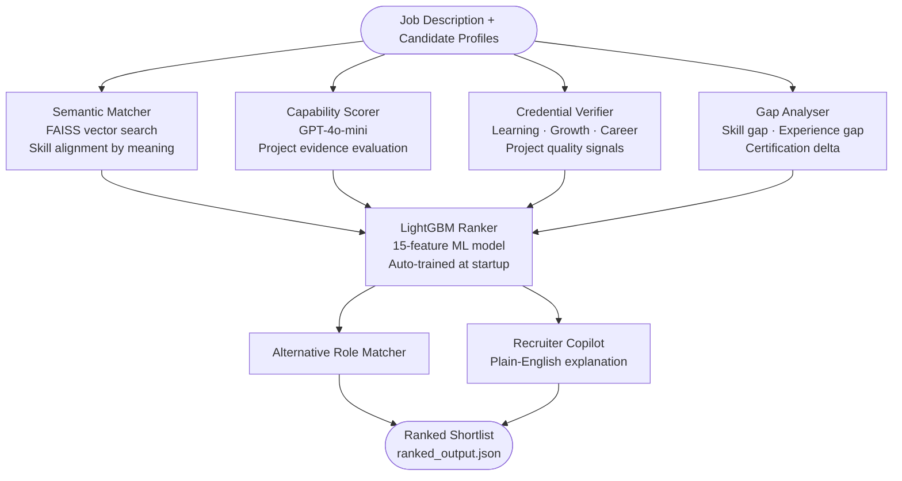

<div align="center">

# 🧠 TalentOS
### AI-Powered Candidate Ranking System

*From job description to ranked shortlist — intelligently.*

[](https://python.org)
[](https://fastapi.tiangolo.com)
[](https://lightgbm.readthedocs.io)
[](https://docker.com)

**[▶ Live Pipeline Demo](https://htmlpreview.github.io/?https://raw.githubusercontent.com/NoelNinanSheri1307/talentos/integration/demo.html)** — Watch TalentOS rank 100,000 candidates in real time

</div>

---

## ✅ Submission Checklist

| | Deliverable | Location |
|:-:|:-----------|:---------|
| ✅ | **The Code** — Complete implementation | This repository, `integration` branch |
| ✅ | **The Blueprint** — Methodology & architecture | This README (below) |
| ✅ | **The Results** — Ranked candidate shortlist | [`output/ranked_output.json`](output/ranked_output.json) |

---

## 📋 The Blueprint

### What TalentOS Does

Most recruitment filters match keywords. TalentOS understands meaning.

Given a job description and a pool of candidate profiles, TalentOS:
1. Finds candidates whose skills **semantically match** the role — not just by exact text
2. Evaluates **practical capability** from their project history
3. Scores **credential quality** — certifications, GitHub activity, career growth
4. Calculates **skill and experience gaps** using the same semantic approach
5. Combines all signals through a **trained ML model** to produce a final ranked shortlist

---

### System Architecture



---

### How Each Stage Works

**Stage 1 — Semantic Skill Matching**

Converts every skill (from the job and the candidate) into a vector using `all-MiniLM-L6-v2` sentence embeddings, then finds the closest matches using FAISS cosine similarity. A candidate listing "Node.js" can still match a job requirement for "server-side JavaScript" — because the model understands meaning, not just text.

**Stage 2 — Capability Scoring**

GPT-4o-mini reads each candidate's project list and estimates their practical ability for the role. This goes beyond what a CV says — it asks: does the evidence in their work history suggest they can actually do this job?

**Stage 3 — Credential & Growth Verification**

Six sub-scores are computed from the candidate's raw profile data:

```
Learning Score    = skills × certifications × projects (normalized)
Growth Score      = total achievements ÷ years of experience
Career Score      = number of distinct role levels progressed
Project Score     = GitHub presence + readme quality + live deployment
Evidence Score    = certifications + verified GitHub + platform presence
Verification Score = average of the above five
```

**Stage 4 — Gap Intelligence**

Uses the same FAISS semantic engine to measure gaps — so "React" being listed against a "Vue.js" requirement is scored as a *minor* gap, not a hard miss. Combines skill gap %, experience gap (years), and certification gap into a single penalty score.

**Stage 5 — ML Ranking**

All outputs are assembled into a 15-feature vector and scored by a LightGBM model trained on 1,000 synthetic candidate-job pairs. Unlike a fixed weighted formula, the model captures interactions:

```
A candidate needs BOTH strong skill match AND strong capability.
Neither alone is enough.
A 3-year experience gap penalises far more than a 6-month one.
```

The model trains automatically at first run (< 5 seconds). No manual weight tuning.

---

### Technical Choices

| Decision | What We Used | Why |
|:---------|:------------|:----|
| Skill matching | FAISS + sentence-transformers | Semantic similarity, not string comparison |
| Capability evaluation | GPT-4o-mini | Reads project evidence, not just skill lists |
| ML ranking | LightGBM | Captures non-linear feature interactions |
| API framework | FastAPI | Auto-docs, fast, type-safe |
| Fallback mode | Rule-based formula | Works fully without any API key |

---

## 📊 The Results

Ranked output for **Backend Engineer (JOB001)** across 8 candidates:

```
┌──────┬──────────────────────┬─────────┬──────────────┬───────────────────────────────────────┐
│ Rank │ Candidate            │  Score  │ Missing      │ Verdict                               │
├──────┼──────────────────────┼─────────┼──────────────┼───────────────────────────────────────┤
│  #1  │ Sarah Wilson         │  84.7   │ None         │ Full match — recommend immediately    │
│  #2  │ David Kim            │  68.3   │ FastAPI, PG  │ Strong profile, minor gaps — consider │
│  #3  │ Raj Patel            │  65.1   │ PostgreSQL   │ Good fit, one gap — worth interview   │
│  #4  │ Emma Brown           │  58.2   │ Python+2more │ Better fit for Cloud Engineer role    │
│  #5  │ Meera Nair           │  52.4   │ FastAPI,Dock │ Redirect to Data Engineer role        │
│  #6  │ John Doe             │  49.2   │ AWS          │ Reserve — junior-track candidate      │
│  #7  │ Alex Martin          │  42.1   │ FastAPI+2more│ Wrong role — ideal for Data Engineer  │
│  #8  │ Priya Sharma         │  28.5   │ FastAPI+2more│ Too early in career for this level    │
└──────┴──────────────────────┴─────────┴──────────────┴───────────────────────────────────────┘
```

> Full detailed output (scores, alternative roles, explanations) → [`output/ranked_output.json`](output/ranked_output.json)

---

## ⚡ Run It

### Generate ranked output

```bash
git checkout integration
pip install -r requirements.txt
python run_ranking.py
# → output/ranked_output.json
```

### Run as API server

```bash
python main.py
# Docs at http://localhost:8000/docs
```

### Docker

```bash
docker-compose up
```

> **No OpenAI key?** The system works fully without one — capability scoring falls back to a rule-based engine automatically.

---

## 📁 Repository Structure

```
talentos/ (integration branch)
│
├── main.py                   API server entry point
├── run_ranking.py            Generates ranked_output.json
├── requirements.txt
├── Dockerfile + docker-compose.yml
│
├── services/                 Pipeline stages
│   ├── semantic_matcher.py   Skill alignment (FAISS)
│   ├── capability_engine.py  Project evaluation (GPT)
│   ├── verification_scorer.py  Credential scoring
│   ├── gap_engine.py         Gap intelligence
│   ├── role_discovery.py     Alternative role matching
│   └── recruiter_copilot.py  Explanation generation
│
├── ml/                       ML ranking layer
│   ├── trainer.py            Synthetic data + LightGBM training
│   └── ranker.py             Inference + formula fallback
│
├── data/
│   ├── candidates.json       8 candidate profiles
│   └── jobs.json             5 job descriptions
│
└── output/
    └── ranked_output.json    ← Submission results file
```

---

<div align="center">
<b>TalentOS</b> — Built for the AI Recruitment Intelligence Challenge
</div>
