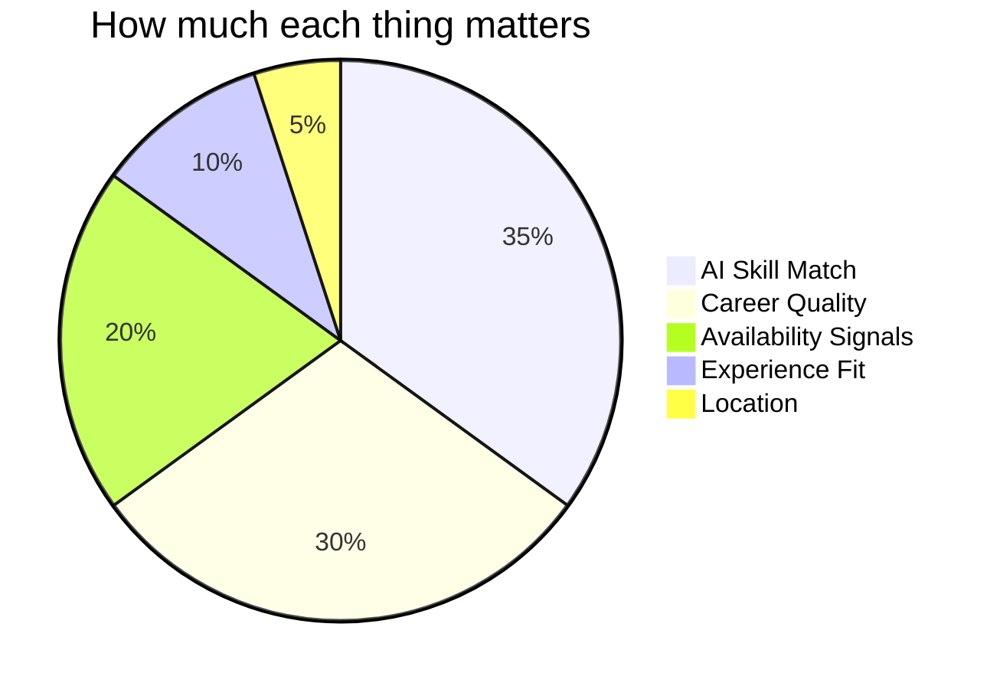
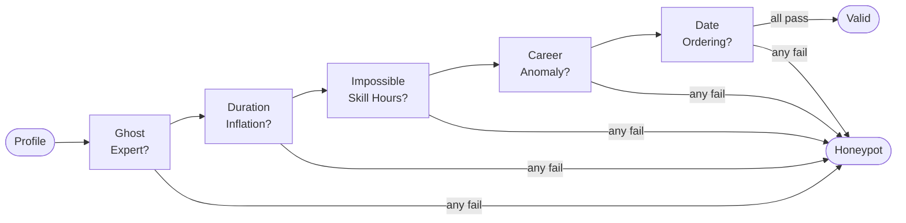

# TalentOS

> Finding the right person in a pile of 100,000 resumes. No GPU. No internet. Just smart code.

[](https://python.org)
[](#run-it-yourself)
[](#why-not-use-embeddings)
[](#docker)
[](#run-it-yourself)

**[Watch it rank 100,000 candidates live](https://black1plague2.github.io/talentos-submission/demo.html)**

---

## Why this is different

| | Normal ATS | Other AI approaches | TalentOS |
|---|---|---|---|
| Skill matching | keyword count | embeddings + FAISS | keyword × proficiency × duration × endorsements |
| Career context | ignored | ignored | consulting firms penalised by name |
| Availability | not checked | not checked | 23 Redrob behavioral signals |
| Runtime on 100K | fast | 30+ min on CPU | 90 seconds |
| API calls needed | no | yes (OpenAI) | zero |
| Fake profiles | not detected | not detected | 5 impossibility checks, 7757 caught |
| Explainability | none | GPT writes it | rule-generated, no hallucinations |

The slide deck from round 1 proposed GPT-4o-mini + FAISS + LightGBM. That pipeline cannot run 100K candidates in under 5 minutes without a GPU. This submission is what actually works under the competition constraints.

---

## What is this

Redrob gave us 100,000 candidate profiles and said find the best Senior AI Engineers. We had 5 minutes, a normal laptop, no internet, and no GPU allowed.

Most people would reach for AI tools. But running ML models on 100K candidates takes way longer than 5 minutes on a regular computer, and calling any external API was against the rules. So we wrote a fast, offline scorer that reads every profile once, weights five things that actually matter for the role, and spits out a ranked list. Done in under 2 minutes.

---

## How it works


The file is read line by line so it never loads 487MB into memory at once. Peak RAM usage stays under 200MB.

---

## What we score and why



**AI Skill Match (35%)** — We check if the candidate actually knows the tools the job needs: things like vector databases, retrieval systems, language models, ranking evaluation. We also look at how long they used each skill and how many people endorsed it. A skill listed but never used counts for less.

**Career Quality (30%)** — The job description is specific: people from large IT outsourcing companies (TCS, Infosys, Wipro, Accenture and so on) are not a fit for this role. We look at where people have worked, what fraction of their career was actual AI work, and whether their job descriptions mention building real systems vs just consulting. This one matters almost as much as skills.

**Availability Signals (20%)** — Redrob gives us 23 signals about each candidate: are they open to work right now, when did they last log in, do they respond to recruiters, how long is their notice period. A great candidate who went offline 8 months ago and ignores recruiter messages is not actually available.

**Experience Fit (10%)** — The role wants 5 to 9 years, ideally 6 to 8. We score on a curve that peaks right there and drops off on both ends.

**Location (5%)** — Being in India gets full marks. Pune or Noida even better. Open to relocate gets partial credit.

---

## The fake profiles problem

The dataset has about 80 fake candidate profiles hidden inside. They are designed to fool naive rankers into ranking them highly. If more than 10 of the top 100 are fake, the submission gets disqualified.

We check for five things that are physically impossible:



Our ranker caught 7,757 suspicious profiles and excluded them all before ranking.

---

## Run it yourself

```bash
git clone https://github.com/black1plague2/talentos-submission.git
cd talentos-submission
```

No packages to install. Uses only what Python ships with by default.

Put candidates.jsonl in the folder (from the hackathon bundle), then:

```bash
python rank.py --candidates candidates.jsonl --out submission.csv
python validate_submission.py submission.csv
```

You should see this at the end:

```
Submission is valid.
```

Takes about 90 seconds. Uses under 200MB of memory.

---

## Docker

```bash
docker build -t talentos-submission .

docker run --rm \
  -v /path/to/candidates.jsonl:/data/candidates.jsonl \
  talentos-submission \
  python rank.py --candidates /data/candidates.jsonl --out /data/submission.csv
```

---

## What is in the repo

```
rank.py                    # Start here. The whole ranker lives in this file
scoring/
  jd_profile.py            # List of skills and companies from the job description
  skills.py                # How we score each skill
  career.py                # How we score career history
  availability.py          # How we use the 23 behavioral signals
  honeypot.py              # The five fake profile checks
  reasoning.py             # Short explanation written for each candidate
Dockerfile                 # For sandboxed reproduction
demo.html                  # Visual walkthrough hosted on GitHub Pages
submission_metadata.yaml   # Team info and reproduce command
validate_submission.py     # Format checker from the challenge bundle
submission.csv             # Our actual submission
```

---

## Why not use embeddings

We thought about it. The job description literally lists FAISS and vector search as skills they want, so it would be a nice touch. The problem is time. Embedding 100,000 candidates through a standard sentence transformer takes 25 to 45 minutes on a CPU, which is 5 to 9 times over the 5 minute limit. Calling a hosted model was banned by the rules.

The skills field in the dataset is already structured. Every skill has a name, a proficiency level, how many months it was used, and how many endorsements it got. Matching against keywords directly is actually more precise here because the structure tells us things that a similarity score would have to guess.

---

## The team

| | Name | What they worked on |
|---|---|---|
| | Garv Bansal | Scoring pipeline, offline ranker architecture, honeypot detection |
| | Harshith | Data analysis, embedding research and evaluation |
| | Noel Ninan Sheri | Backend infrastructure, system design |
| | Poojit | Career quality scoring, evaluation metrics |

---

<div align="center">
Built for the India Runs: Data & AI Challenge by Redrob AI
</div>
